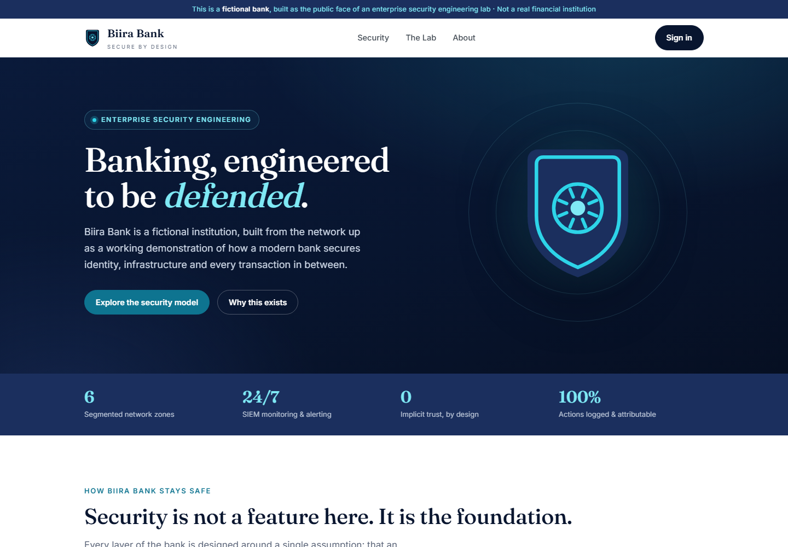
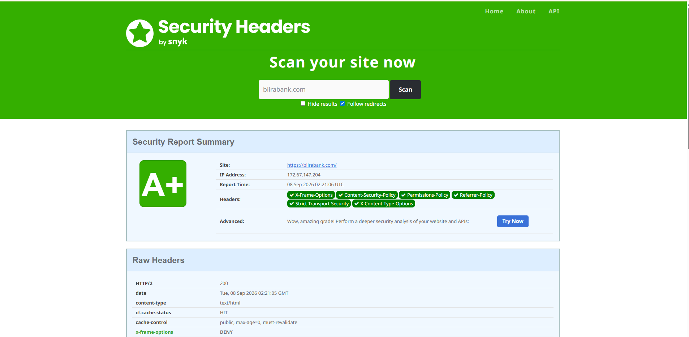

<picture>
  <source media="(prefers-color-scheme: dark)" srcset="images/lockup-reverse.png">
  
</picture>

# biirabank.com

The public website of Biira Bank, the fictional bank behind an enterprise security engineering lab. Live at **https://biirabank.com**.

Biira Bank is not a bank. It holds no deposits, has no customers and provides no financial services. The site exists so that the lab has an external tier: something on the internet, with a real domain, that can be hardened, graded by independent scanners and, later, used as the front for work that needs a public face.



## Why the lab needed a website

Everything else in the lab sits behind a firewall on private address space. That leaves out a whole class of controls that only exist at the edge: a web application firewall, transport security that third parties can grade, browser security headers, bot filtering, rate limiting. A public site brings all of those into scope, and it gives the red team host a target that is legitimately in bounds because the lab owns the domain.

It is also where two later pieces of work will land: an Okta sign-in hand-off into the lab's directory, and an AI support assistant governed as a non-human identity. Both need a real public surface to be meaningful.

## How it is built

Plain HTML and CSS, no framework, no JavaScript, no build step. The `public/` folder is uploaded to Cloudflare's edge as Worker static assets:

```bash
npx wrangler deploy
```

Static assets on Workers rather than Cloudflare Pages was a deliberate choice. Cloudflare recommends it for new projects, and it leaves room for server-side code later without a migration. `wrangler.jsonc` carries the reasoning in its comments.

```
biirabank-web/
├── public/
│   ├── index.html      the page
│   └── styles.css      all styling, no inline styles
├── wrangler.jsonc      Cloudflare Workers configuration
└── images/             README images only, not deployed
```

## How it is hardened

Every control is applied at the zone level on `biirabank.com` and verified from outside Cloudflare's own dashboard.

| Control | Setting |
|---|---|
| Encryption mode | Full (Strict): the origin must present a certificate from a real authority |
| Minimum TLS | 1.2. Handshakes at 1.0 and 1.1 are refused, confirmed by attempting each |
| Always Use HTTPS | On. Plain `http://` redirects before any content is served |
| `Strict-Transport-Security` | `max-age=31536000; includeSubDomains` |
| `X-Content-Type-Options` | `nosniff` |
| `X-Frame-Options` | `DENY` |
| `Referrer-Policy` | `strict-origin-when-cross-origin` |
| `Permissions-Policy` | `camera=(), microphone=(), geolocation=(), payment=()` |
| `Content-Security-Policy` | `default-src 'none'`, styles and fonts from self and Google Fonts only, images from self, `frame-ancestors 'none'`, no script source at all |
| `workers.dev` hostname | Disabled, so the site cannot be reached on a hostname the zone controls do not cover |
| Real User Monitoring | Off. It injects a script, and the policy allows none |

The Content Security Policy has no `script-src` because the page has no scripts. That is the strongest possible policy and it is only possible because the site was built to deserve it: the one inline script it originally shipped with was removed rather than allowlisted.

### The grade that moved

Scanned by an independent grader before hardening and again about an hour later. A score on its own proves little; a score that moves proves the work happened, and this scoreboard is public and not under the lab's control.



Before: grade **F**, five of the six headers absent, and the scan had resolved over plain `http://`. After: grade **A+**, all six headers present over `https://`, with `cf-cache-status: HIT` confirming the page is served from the edge cache and never reaches an origin server.

### The finding

After the custom domain was attached, the site was still reachable on its default `*.workers.dev` hostname, and the dashboard toggles for that hostname appeared to be off. Every control above applies to `biirabank.com`, not to Cloudflare's own domain, so a visitor using the `workers.dev` name would have received the same page with none of the protections. A textbook alternate-hostname bypass, and the kind of finding that leads a penetration test report. It was found by testing rather than by reading the dashboard, and closed.

## Still to do

- Enable the WAF managed ruleset, with a Security Events capture showing a genuine blocked request
- SSL Labs grade, a second independent scoreboard covering the TLS work specifically
- SPF, DMARC and a null MX record, so the domain cannot be used to send spoofed mail
- The Okta sign-in hand-off, and later the governed AI assistant

## The rest of the lab

- Full write-up of this site and its hardening: [docs/18, Public web presence and edge hardening](https://github.com/noble-antwi/enterprise-security-homelab/blob/main/docs/18-public-web-presence-and-edge-hardening.md)
- The security homelab behind it: [enterprise-security-homelab](https://github.com/noble-antwi/enterprise-security-homelab)
- The identity estate: [enterprise-iam-lab](https://github.com/noble-antwi/enterprise-iam-lab)
- The engineer: [nobleantwi.com](https://nobleantwi.com)

---

Biira Bank is a fictional entity created for security engineering practice. It is not licensed or regulated, does not hold deposits and provides no financial services of any kind. Any resemblance to a real organisation is coincidental.
